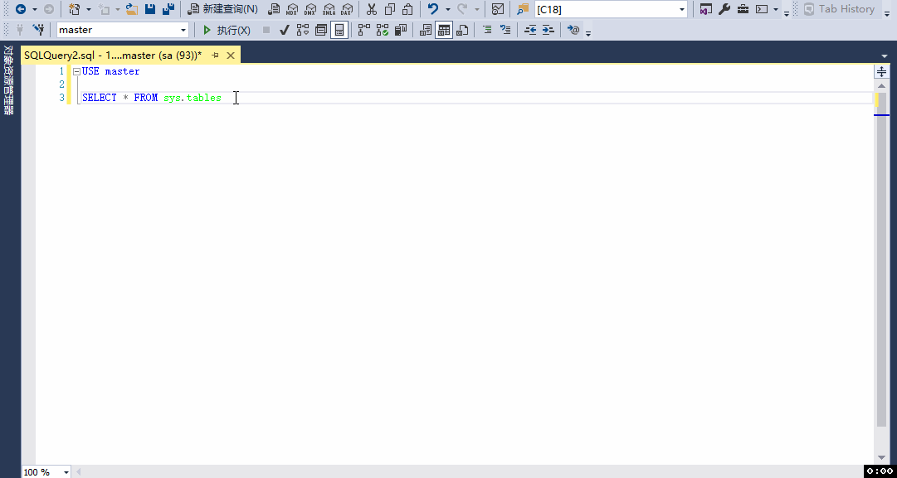

# Mysql 与 SQL server 区别记录

## 基本语句

1. 查看表结构

    - SQL Server

      ```sql
      --如果是在SSMS，可以直接写表名，选中表名 ALT + F1, 如下图
      EXEC sys.sp_help  @objname = N'[TableName]'
      ```

      

    - Mysql

      ```sql
      show full FIELDS from [tableName]
      show full columns from [tableName]
      ```

2. 判断表是否存在(不存在则创建)

    - SQL Server

      ```sql
      IF NOT EXISTS(SELECT 1 FROM TABLE)
      BEGIN
      CREATE TABLE ...
      END
      ```

    - Mysql

      ```sql
      CREATE TABLE IF NOT EXISTS TABLE1(ID VARCHAR(30))
      ```

3. 关联更新

    - SQL Server

      ```sql
      UPDATE tableA
      SET tableA.Column1 = tableB.Column2
      FROM [tableName] tableA , [tableName] tableB [join ..]
      WHERE tableA.Id = tableB.XXId
        AND...
      ```

    - Mysql

      ```sql
      UPDATE tableA, tableB [join ..]
      SET tableA.Column1 = tableB.Column2
      WHERE tableA.Id = tableB.XXId
          AND...
      ```

      *mysql可以同时更新多个表的字段，`update tableA,tableB set tableA.column1 = 'a',tableB.column2 = 'b' where ...`*

4. 分页查询

    - SQL Server

        ```sql
        SELECT * FROM [TableName] [WHERE ...] ORDER BY column [ASC|DESC] OFFSET {(page - 1) * rows} ROWS FETCH NEXT {rows} ROWS ONLY
        ```

        *SQL Server `OFFSET FETCH` 是从 `sqlserver 2012` 版本开始支持的。对于之前版本可以使用 [ROW_NUMBER (Transact-SQL)](https://docs.microsoft.com/zh-cn/sql/t-sql/functions/row-number-transact-sql?view=sql-server-ver15) 函数实现*

    - Mysql

        ```sql
        SELECT * FROM [TableName] [WHERE ...] ORDER BY column [ASC|DESC] LIMIT {(page - 1) * rows} , {rows}
        ```

5. 为相同数据添加排序号

    - SQL Server

      ```sql
      CREATE TABLE #testTemp
      (
         id          INT IDENTITY(1, 1) NOT NULL,
         name        VARCHAR(10),
         update_date DATETIME NULL
      );

      INSERT INTO #testTemp
            (name,update_date)
      VALUES ('A','2021-02-08'),
             ('A','2021-01-01'),
             ('B','2021-01-01'),
             ('B','2021-02-08')

      SELECT Row_number()
         OVER(
           partition BY name
           ORDER BY update_date DESC) AS rowNum,*
      FROM   #testTemp 
      ```

    - Mysql

      ```sql
      SELECT @row_number := CASE
        WHEN @name = name THEN @row_number +1
        ELSE 1
      END as row_num,
      @name := name as name
      FROM testTemp,(SELECT @row_number:=0,@name:='') as t
      ORDER BY update_date DESC; 
      ```

      *此处为使用变量实现，`mysql 8.0` 也支持了 `ROW_NUMBER()`函数，用法与SQL Server 相同, 可参考 [ROW_NUMBER()](https://dev.mysql.com/doc/refman/8.0/en/window-function-descriptions.html#function_row-number) 使用*

6. 判空

    - SQL Server

      ```sql
      ISNULL( table.column, '' ) <> '' 
      ```

    - Mysql

      ```sql
      IFNULL( table.column, '' ) != '' 
      ```

7. 备份表数据

    - 未创建备份表 `xx_bak`
        - SQL Server

          ```sql
          SELECT * 
          INTO xx_bak
          FROM xx
          WHERE ...
          ```

        - Mysql

          ```sql
          CREATE TABLE xx_bak
          SELECT * FROM xx 
          WHERE ...
          ```

    - 已创建备份表 `xx_bak`
        - SQL Server

          ```sql
          INSERT INTO xx_bak(column_names)
          SELECT column_names FROM xx
          WHERE ...
          ```

        - Mysql

          ```sql
          INSERT INTO xx_bak(column_names)
          SELECT column_names FROM xx
          WHERE ...
          ```

8. 创建临时表

    - SQL Server

      ```sql
      CREATE TABLE #tempTable
      (
         Id          INT IDENTITY(1, 1) NOT NULL
      );
      ```

    - Mysql

      ```sql
      CREATE TEMPORARY TABLE temp_table (
        `Id` int(11) NOT NULL AUTO_INCREMENT,
        PRIMARY KEY (`Id`)
      );
      ```
9. 多空格合并一个空格

    - SQL Server

      ```sql
      
      ```

    - Mysql

      ```sql
      SELECT REPLACE ( REPLACE ( REPLACE ( LTRIM( RTRIM( ' Test   Name Test  Name   Test ' )), '  ', ' #' ), '# ', '' ), '#', '' )  AS str;
      ```
